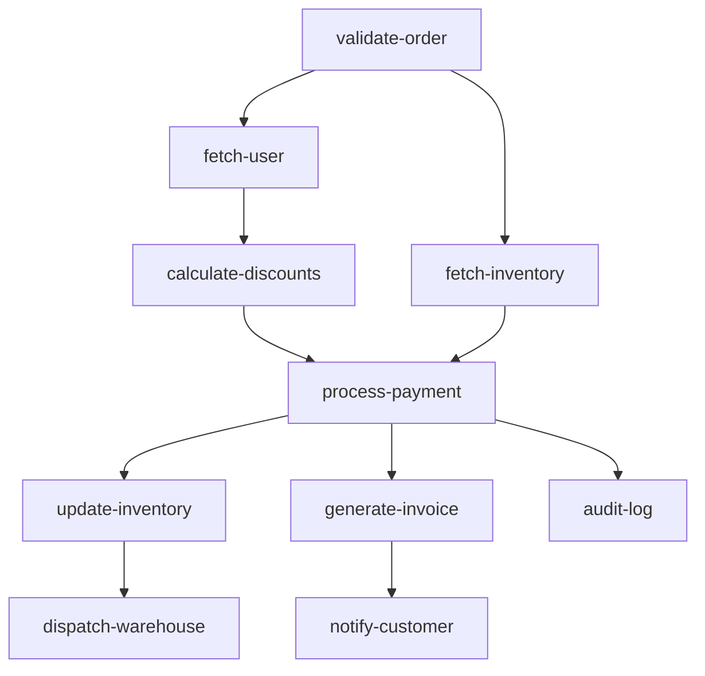

# Getting Started with go-flow

A step-by-step guide to building structured concurrency workflows and dependency graphs in Go with `go-flow`.

---

## Table of Contents

- [Core Concepts](#core-concepts)
- [1. Method Chaining & Error Handling](#1-method-chaining--error-handling)
- [2. Sequential Execution (`Seq`)](#2-sequential-execution-seq)
- [3. Concurrent Execution (`Go` and `GoN`)](#3-concurrent-execution-go-and-gon)
- [4. Speculative Racing (`Race`)](#4-speculative-racing-race)
- [5. Conditional & Dynamic Execution (`Branch`, `When`, `Unless`, `Dynamic`)](#5-conditional--dynamic-execution-branch-when-unless-dynamic)
- [6. Functional Piping (`Pipe`, `PipeSeq`)](#6-functional-piping-pipe-pipeseq)
- [7. Iterators & Batching (`Each`, `Chunk`)](#7-iterators--batching-each-chunk)
- [8. Idempotent Execution (`Once`)](#8-idempotent-execution-once)
- [9. Dependency Graphs (`DAG`)](#9-dependency-graphs-dag)
  - [1. Named Nodes (`Node` + `After`)](#1-named-nodes-node--after)
  - [2. Pure Function Edges (`From.To`)](#2-pure-function-edges-fromto)
  - [3. Pairwise Edge Helper (`Edge`)](#3-pairwise-edge-helper-edge)
  - [4. Pre-Execution Validation & Cycle Path Tracing](#4-pre-execution-validation--cycle-path-tracing)
  - [5. Bounded Concurrency DAGs (`DAGN` / `DAGEdgesN` / `StepN`)](#5-bounded-concurrency-dags-dagn--dagedgesn--stepn)
  - [6. Composite & Resilient DAG Nodes](#6-composite--resilient-dag-nodes)
  - [7. DAG Execution Reports & Observability](#7-dag-execution-reports--observability)
  - [8. Visual Graph Export (Mermaid & Graphviz DOT)](#8-visual-graph-export-mermaid--graphviz-dot)
- [10. Custom Contexts](#10-custom-contexts)
- [Examples Catalog](#examples-catalog)

---

## Core Concepts

In `go-flow`, every unit of work is a `Step[T]`:

```go
type Step[T context.Context] func(ctx T) error
```

- **Generic over Context**: `T` satisfies `context.Context`, allowing you to use `context.Context` directly or pass custom context structs without type assertions.
- **Composable**: Steps compose cleanly using function combinators (`Seq`, `Go`, `Race`, `DAG`) or fluent receiver methods (`.Then()`, `.Retry()`, `.Timeout()`, `.Catch()`).
- **Resilient**: Every composite combinator cleanly handles context cancellation, deadline timeouts, error joining via `errors.Join`, and panic recovery.

---

## 1. Method Chaining & Error Handling

Every `Step[T]` provides receiver methods to attach timeouts, retries, fallbacks, panic recovery, error suppression, and middleware:

```go
validateInput := flow.Step[context.Context](validateStep)
fetchUserData := flow.Step[context.Context](fetchUserStep)
updateCache   := flow.Step[context.Context](updateCacheStep)

pipeline := validateInput.
 Then(fetchUserData.Retry(3, 100*time.Millisecond).Timeout(2*time.Second)).
 Then(updateCache.Once()).
 Recover()

if err := pipeline.Exec(ctx); err != nil {
 log.Println("Pipeline failed:", err)
}
```

### Available Methods

- `.Then(next Step[T]) Step[T]`: Chains steps sequentially.
- `.Go(steps ...Step[T]) Step[T]`: Runs subsequent steps concurrently.
- `.GoN(limit int, steps ...Step[T]) Step[T]`: Runs steps with bounded concurrency.
- `.Race(steps ...Step[T]) Step[T]`: Races against other steps, returning first success.
- `.Timeout(d time.Duration) Step[T]`: Enforces maximum execution duration.
- `.Retry(attempts int, delay time.Duration) Step[T]`: Retries on failure up to $N$ attempts.
- `.Fallback(fallback Step[T]) Step[T]`: Runs fallback step if primary step fails.
- `.Catch(handler func(error) error) Step[T]`: Transforms or suppresses errors.
- `.Recover() Step[T]`: Recovers panics into structured Go errors.
- `.Once() Step[T]`: Guarantees the step executes only once per lifetime.
- `.When(pred func(T) bool) Step[T]`: Executes step only if predicate is true.
- `.Unless(pred func(T) bool) Step[T]`: Executes step only if predicate is false.
- `.Branch(pred func(T) bool, onTrue, onFalse Step[T]) Step[T]`: Dynamic branching.
- `.Wrap(middleware func(Step[T]) Step[T]) Step[T]`: Applies middleware.

---

## 2. Sequential Execution (`Seq`)

Executes steps in strict sequential order. If any step returns an error, execution stops immediately and the error is returned without running subsequent steps.

```go
package main

import (
 "context"
 "fmt"

 "github.com/ntkwan/go-flow"
)

func main() {
 workflow := flow.Seq(
  func(ctx context.Context) error {
   fmt.Println("Step 1: Validate input")
   return nil
  },
  func(ctx context.Context) error {
   fmt.Println("Step 2: Save to database")
   return nil
  },
 )

 if err := workflow(context.Background()); err != nil {
  panic(err)
 }
}
```

*See runnable comparison: [`examples/seq/with_flow`](examples/seq/with_flow/main.go) vs [`examples/seq/without_flow`](examples/seq/without_flow/main.go)*

---

## 3. Concurrent Execution (`Go` and `GoN`)

### Unbounded Concurrency (`Go`)

Spawns each step in a separate goroutine concurrently and waits for all to complete. Errors are aggregated using `errors.Join`.

```go
workflow := flow.Go(
 func(ctx context.Context) error { return fetchUserProfile(ctx) },
 func(ctx context.Context) error { return fetchUserOrders(ctx) },
 func(ctx context.Context) error { return fetchUserPreferences(ctx) },
)

if err := workflow(ctx); err != nil {
 log.Println("Workflow errors:", err)
}
```

*See runnable comparison: [`examples/go/with_flow`](examples/go/with_flow/main.go) vs [`examples/go/without_flow`](examples/go/without_flow/main.go)*

### Bounded Concurrency (`GoN`)

Caps active concurrent goroutines to a fixed worker limit using an internal semaphore.

```go
var steps []flow.Step[context.Context]
for _, item := range batchItems {
 steps = append(steps, func(ctx context.Context) error {
  return processItem(ctx, item)
 })
}

// Process concurrently with at most 5 active workers
pipeline := flow.GoN(5, steps...)
if err := pipeline(ctx); err != nil {
 log.Println("Processing failed:", err)
}
```

*See runnable comparison: [`examples/gon/with_flow`](examples/gon/with_flow/main.go) vs [`examples/gon/without_flow`](examples/gon/without_flow/main.go)*

---

## 4. Speculative Racing (`Race`)

Executes multiple steps simultaneously. As soon as the first step succeeds, `Race` returns immediately and cancels the context of all losing branches. If all steps fail, all errors are joined and returned.

```go
// Query multiple replicas; returns on first success and cancels the others
fastest := flow.Race(
 func(ctx context.Context) error { return queryPrimaryServer(ctx) },
 func(ctx context.Context) error { return queryMirrorServer(ctx) },
 func(ctx context.Context) error { return queryCachedReplica(ctx) },
)

if err := fastest(ctx); err != nil {
 log.Println("All endpoints failed:", err)
}
```

*See runnable comparison: [`examples/race/with_flow`](examples/race/with_flow/main.go) vs [`examples/race/without_flow`](examples/race/without_flow/main.go)*

---

## 5. Conditional & Dynamic Execution (`Branch`, `When`, `Unless`, `Dynamic`)

Route workflow execution conditionally or evaluate steps lazily based on runtime context state:

```go
// Standalone Branch combinator
evalRisk := flow.Branch(
    func(ctx *OrderContext) bool { return ctx.Total > 100000 },
    manualReviewStep, // Executed when predicate is true
    autoApproveStep,  // Executed when predicate is false
)

// Fluent .When() and .Unless()
vipNotification := sendVIPGiftStep.When(func(ctx *OrderContext) bool {
    return ctx.IsVIP
})

// Dynamic lazy step selection
dynamicWorkflow := flow.Dynamic(func(ctx *OrderContext) flow.Step[*OrderContext] {
    if ctx.IsVIP {
        return vipProcessingPipeline
    }
    return standardProcessingPipeline
})
```

*See runnable comparisons: [`examples/branch/with_flow`](examples/branch/with_flow/main.go) vs [`examples/branch/without_flow`](examples/branch/without_flow/main.go) · [`examples/dynamic/with_flow`](examples/dynamic/with_flow/main.go) vs [`examples/dynamic/without_flow`](examples/dynamic/without_flow/main.go)*

---

## 6. Functional Piping (`Pipe`, `PipeSeq`)

Bridge pure functional data transforms into workflow steps with compile-time type safety:

```go
// Read from context, compute transform, write result back to context
calculateTax := flow.Pipe(
 func(ctx *OrderContext, subtotal int64) (int64, error) {
  return int64(float64(subtotal) * 0.08), nil
 },
 func(ctx *OrderContext) int64 { return ctx.Subtotal },
 func(ctx *OrderContext, tax int64) { ctx.Tax = tax },
)

// Stream standard Go iterators through a transform step into a sink
streamPipeline := flow.PipeSeq(
 slices.Values([]int{1, 2, 3, 4, 5}),
 func(ctx context.Context, item int) (string, error) {
  return fmt.Sprintf("item-%d", item*2), nil
 },
 func(ctx context.Context, item string) error {
  return saveItem(ctx, item)
 },
)
```

*See runnable comparison: [`examples/pipe/with_flow`](examples/pipe/with_flow/main.go) vs [`examples/pipe/without_flow`](examples/pipe/without_flow/main.go)*

---

## 7. Iterators & Batching (`Each`, `Chunk`)

Process standard Go 1.23+ `iter.Seq` and `iter.Seq2` sequences:

```go
// Process sequence elements
items := slices.Values([]string{"order-1", "order-2", "order-3"})
stream := flow.Each(items, func(ctx context.Context, item string) error {
 return processOrder(ctx, item)
})

// Batch slices into chunks of size N
chunks := flow.Chunk([]int{1, 2, 3, 4, 5, 6, 7}, 3)
// Yields: []int{1, 2, 3}, []int{4, 5, 6}, []int{7}
```

*See runnable comparison: [`examples/each/with_flow`](examples/each/with_flow/main.go) vs [`examples/each/without_flow`](examples/each/without_flow/main.go)*

---

## 8. Idempotent Execution (`Once`)

Wrap expensive initialization, schema migrations, or connection pools to guarantee they execute at most once across parallel branches:

```go
initDB := flow.Once(func(ctx context.Context) error {
 return connectDatabase(ctx)
})

stepA := flow.Seq(initDB, queryUsers)
stepB := flow.Seq(initDB, queryOrders)
```

*See runnable comparison: [`examples/once/with_flow`](examples/once/with_flow/main.go) vs [`examples/once/without_flow`](examples/once/without_flow/main.go)*

---

## 9. Dependency Graphs (`DAG`)

The DAG engine executes complex dependency graphs with maximal branch parallelism, pre-compilation, zero runtime map lookups, and cycle detection.

### 1. Named Nodes (`Node` + `After`)

Define explicit node identifiers for self-documenting workflows and debugging:

```go
userNode := flow.Node("fetch-user", fetchUser)
cartNode := flow.Node("fetch-cart", fetchCart)

paymentNode := flow.Node("process-payment", processPayment).
    After("fetch-user", "fetch-cart")

receiptNode := flow.Node("send-receipt", sendReceipt).
    After("process-payment")

// "fetch-user" and "fetch-cart" run concurrently.
// "process-payment" runs once both complete.
pipeline := flow.DAG(userNode, cartNode, paymentNode, receiptNode)
```

### 2. Pure Function Edges (`From.To`)

Wire functions directly into dependency graphs without string keys:

```go
pipeline := flow.DAGEdges(
    flow.From(fetchUser).To(processPayment),
    flow.From(fetchCart).To(processPayment),
    flow.From(processPayment).To(sendReceipt),
)
```

### 3. Pairwise Edge Helper (`Edge`)

Concise shorthand for direct edge connections:

```go
pipeline := flow.DAGEdges(
    flow.Edge(fetchUser, processPayment),
    flow.Edge(fetchCart, processPayment),
    flow.Edge(processPayment, sendReceipt),
)
```

### 4. Pre-Execution Validation & Cycle Path Tracing

Validate dependency graphs ahead of time with `plan.Validate()`. `go-flow` detects graph anomalies before any goroutines spawn, producing human-readable cycle path traces:

```go
plan := flow.NewDAG(
    flow.Node("A", stepA).After("C"),
    flow.Node("B", stepB).After("A"),
    flow.Node("C", stepC).After("B"),
)

if err := plan.Validate(); err != nil {
    if errors.Is(err, flow.ErrDAGCycle) {
        // Output: "cycle detected in DAG: A -> B -> C -> A"
        log.Printf("Cycle detected: %v", err)
    }
}
```

**Exported Sentinel Errors:**

| Sentinel Error | Description |
| :--- | :--- |
| `flow.ErrDAGCycle` | Directed cycle detected (includes human-readable cycle path, e.g. `A -> B -> C -> A`). |
| `flow.ErrDAGUnknownDependency` | A node references a dependency name that does not exist in the graph. |
| `flow.ErrDAGDuplicateNode` | Multiple nodes share the same name in the DAG. |
| `flow.ErrDAGNilNode` | A `nil` pointer was provided as a `*DAGNode[T]`. |
| `flow.ErrDAGEmptyNodeName` | A node was created with an empty string name. |

### 5. Bounded Concurrency DAGs (`DAGN` / `DAGEdgesN` / `StepN`)

Cap the maximum number of concurrent in-flight nodes across the graph:

```go
// Throttle named DAG execution to at most 2 concurrent node workers
boundedDAG := flow.DAGN(2, userNode, cartNode, paymentNode, receiptNode)

// Or for edge-based DAGs:
boundedEdges := flow.DAGEdgesN(2,
    flow.From(fetchUser).To(processPayment),
    flow.From(fetchCart).To(processPayment),
)

// Or via plan:
workflow := plan.StepN(2)
```

### 6. Composite & Resilient DAG Nodes

Embed retries, timeouts, fallbacks, conditional guards, and sub-pipelines directly onto individual graph nodes using fluent builder methods:

```go
// Node with fluent retry and timeout policies
userNode := flow.Node("fetch-user", fetchUser).
    WithRetry(3, 10*time.Millisecond).
    WithTimeout(500*time.Millisecond)

// Conditional node: skips execution at runtime if predicate is false
vipNode := flow.Node("vip-discount", applyVIPDiscount).
    After("fetch-user").
    When(func(c *Context) bool { return c.IsVIP })

// Inverse conditional node: skips execution when predicate is true
standardNode := flow.Node("standard-shipping", applyStandardShipping).
    After("fetch-user").
    Unless(func(c *Context) bool { return c.IsVIP })

// Embedded sequential pipeline as a single node
enrichNode := flow.Node("enrich-profile",
    flow.Seq(fetchLoyalty, fetchGeoLocation),
).After("fetch-user")

// Protected payment node with secondary fallback gateway
paymentNode := flow.Node("process-payment", primaryGateway).
    After("vip-discount", "enrich-profile").
    WithFallback(secondaryGateway).
    WithRecover()
```

### 7. DAG Execution Reports & Observability

Collect execution summaries, per-node latency, and execution status (`NodeStatusSuccess`, `NodeStatusFailed`, `NodeStatusSkipped`) with zero external dependencies:

```go
// Execute and inspect per-node execution telemetry
report, err := plan.ExecWithReport(ctx)
if err != nil {
    log.Println("Workflow failed:", err)
}

fmt.Printf("DAG completed in %v\n", report.Duration)
for _, node := range report.Nodes {
    fmt.Printf("  • %-15s [%s] took %v (error: %v)\n", node.Name, node.Status, node.Duration, node.Err)
}

// Or query subsets of results:
successfulNodes := report.Successful()
skippedNodes := report.Skipped()
failedNodes := report.Failed()
```

### 8. Visual Graph Export (Mermaid & Graphviz DOT)

Generate diagrams directly from Go code:

```go
plan := flow.NewDAG(userNode, cartNode, paymentNode, receiptNode)

// Export to Mermaid markdown syntax
mermaid, err := plan.ToMermaid()

// Export to Graphviz DOT syntax
dot, err := plan.ToDOT()

// Export from pure function edges
edgeMermaid, err := flow.DAGEdgesToMermaid(
    flow.From(fetchUser).To(processPayment),
    flow.From(fetchCart).To(processPayment),
)
```

<!-- AUTO-GENERATED-DAG:START -->

<!-- AUTO-GENERATED-DAG:END -->

*See runnable comparisons under [`examples/dag/`](examples/dag/): [`1_named_nodes`](examples/dag/1_named_nodes/with_flow/main.go), [`2_fluent_edges`](examples/dag/2_fluent_edges/with_flow/main.go), [`3_resilient_composite`](examples/dag/3_resilient_composite/with_flow/main.go), [`4_bounded_concurrency`](examples/dag/4_bounded_concurrency/with_flow/main.go), [`5_visual_export`](examples/dag/5_visual_export/with_flow/main.go), [`6_conditional_and_report`](examples/dag/6_conditional_and_report/main.go)*

---

## 10. Custom Contexts

`Step[T]` is generic over any type implementing `context.Context`. This gives compile-time type safety across your entire business domain without manual context casting:

```go
type OrderContext struct {
 context.Context
 OrderID string
 UserID  string
 Total   int64
 Paid    bool
}

func validateOrder(ctx *OrderContext) error {
 if ctx.Total <= 0 {
  return errors.New("invalid order total")
 }
 return nil
}

func chargePayment(ctx *OrderContext) error {
 ctx.Paid = true
 return nil
}

orderPipeline := flow.Seq(
 flow.Step[*OrderContext](validateOrder),
 flow.Step[*OrderContext](chargePayment),
)

orderCtx := &OrderContext{
 Context: context.Background(),
 OrderID: "ord-883",
 UserID:  "usr-102",
 Total:   15000,
}

if err := orderPipeline(orderCtx); err != nil {
 log.Fatal(err)
}
```

---

## Examples Catalog

Every combinator includes complete, side-by-side comparative implementations showing how code looks **with** `go-flow` vs **without** `go-flow` (manual channels/sync primitives):

| Pattern | With go-flow | Without go-flow |
| :--- | :--- | :--- |
| **Sequential (`Seq`)** | [`examples/seq/with_flow`](examples/seq/with_flow/main.go) | [`examples/seq/without_flow`](examples/seq/without_flow/main.go) |
| **Parallel (`Go`)** | [`examples/go/with_flow`](examples/go/with_flow/main.go) | [`examples/go/without_flow`](examples/go/without_flow/main.go) |
| **Bounded Concurrency (`GoN`)** | [`examples/gon/with_flow`](examples/gon/with_flow/main.go) | [`examples/gon/without_flow`](examples/gon/without_flow/main.go) |
| **Speculative Racing (`Race`)** | [`examples/race/with_flow`](examples/race/with_flow/main.go) | [`examples/race/without_flow`](examples/race/without_flow/main.go) |
| **DAG (Named Nodes)** | [`examples/dag/1_named_nodes/with_flow`](examples/dag/1_named_nodes/with_flow/main.go) | [`examples/dag/1_named_nodes/without_flow`](examples/dag/1_named_nodes/without_flow/main.go) |
| **DAG (Fluent Edges)** | [`examples/dag/2_fluent_edges/with_flow`](examples/dag/2_fluent_edges/with_flow/main.go) | [`examples/dag/2_fluent_edges/without_flow`](examples/dag/2_fluent_edges/without_flow/main.go) |
| **DAG (Resilient Composite)** | [`examples/dag/3_resilient_composite/with_flow`](examples/dag/3_resilient_composite/with_flow/main.go) | [`examples/dag/3_resilient_composite/without_flow`](examples/dag/3_resilient_composite/without_flow/main.go) |
| **DAG (Bounded Concurrency)** | [`examples/dag/4_bounded_concurrency/with_flow`](examples/dag/4_bounded_concurrency/with_flow/main.go) | [`examples/dag/4_bounded_concurrency/without_flow`](examples/dag/4_bounded_concurrency/without_flow/main.go) |
| **DAG (Visual Export)** | [`examples/dag/5_visual_export/with_flow`](examples/dag/5_visual_export/with_flow/main.go) | — |
| **Order Checkout Workflow** | [`examples/order_checkout/with_flow`](examples/order_checkout/with_flow/main.go) | [`examples/order_checkout/without_flow`](examples/order_checkout/without_flow/main.go) |
| **Branching (`Branch`)** | [`examples/branch/with_flow`](examples/branch/with_flow/main.go) | [`examples/branch/without_flow`](examples/branch/without_flow/main.go) |
| **Dynamic Branching (`Dynamic`)** | [`examples/dynamic/with_flow`](examples/dynamic/with_flow/main.go) | [`examples/dynamic/without_flow`](examples/dynamic/without_flow/main.go) |
| **Piping & Streams (`Pipe`)** | [`examples/pipe/with_flow`](examples/pipe/with_flow/main.go) | [`examples/pipe/without_flow`](examples/pipe/without_flow/main.go) |
| **Retry Combinator** | [`examples/retry/with_flow`](examples/retry/with_flow/main.go) | [`examples/retry/without_flow`](examples/retry/without_flow/main.go) |
| **Timeout Combinator** | [`examples/timeout/with_flow`](examples/timeout/with_flow/main.go) | [`examples/timeout/without_flow`](examples/timeout/without_flow/main.go) |
| **Fallback Combinator** | [`examples/fallback/with_flow`](examples/fallback/with_flow/main.go) | [`examples/fallback/without_flow`](examples/fallback/without_flow/main.go) |
| **Once Combinator** | [`examples/once/with_flow`](examples/once/with_flow/main.go) | [`examples/once/without_flow`](examples/once/without_flow/main.go) |
| **Iterator Streaming (`Each`)** | [`examples/each/with_flow`](examples/each/with_flow/main.go) | [`examples/each/without_flow`](examples/each/without_flow/main.go) |
| **Middleware Wrapping (`Wrap`)** | [`examples/wrap/with_flow`](examples/wrap/with_flow/main.go) | [`examples/wrap/without_flow`](examples/wrap/without_flow/main.go) |
