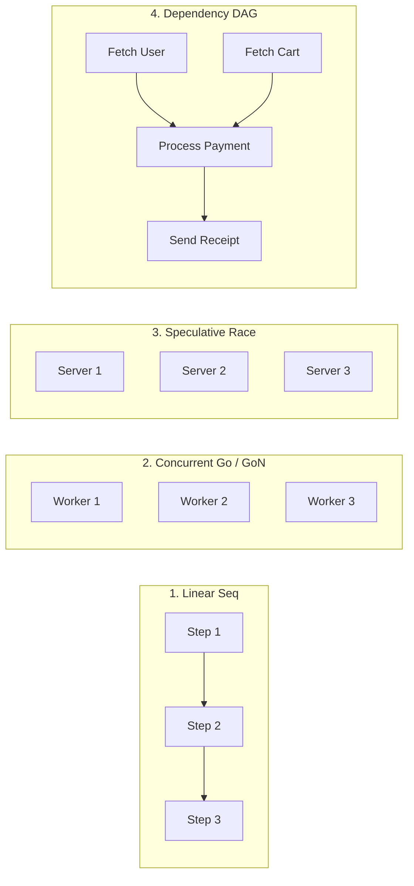
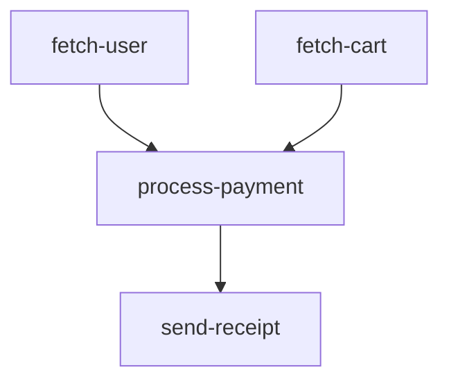

# go-flow

[](https://github.com/ntkwan/go-flow/actions/workflows/ci.yml)
[](https://pkg.go.dev/github.com/ntkwan/go-flow)
[](https://go.dev)
[](https://github.com/ntkwan/go-flow/releases)
[](https://github.com/ntkwan/go-flow/actions)
[](LICENSE)

A high-performance, minimalist Go structured concurrency and workflow orchestration engine designed for modern Go (1.24+). Built with generics, standard iterators, and zero external dependencies.

Inspired by the structured execution model of C++26 `std::execution` ([`NVIDIA/stdexec`](https://github.com/NVIDIA/stdexec)), `go-flow` brings declarative, composable execution graphs and execution combinators to idiomatic Go. It replaces unstructured goroutine lifecycles and manual channel boilerplate with strictly scoped, cancellable, and resilient execution pipelines.

## Features

- **Generic Step Abstraction**: `Step[T context.Context]` operates natively on standard contexts and custom context types.
- **Fluent Receiver Methods**: Chain, compose, and harden steps with `.Then()`, `.Go()`, `.GoN()`, `.Race()`, `.Once()`, `.Timeout()`, `.Retry()`, `.Fallback()`, `.Catch()`, `.Recover()`, `.When()`, `.Unless()`, `.Branch()`.
- **Sequential Execution (`Seq`)**: Executes steps in strict order, aborting immediately on the first error.
- **Conditional Branching (`Branch`)**: Clean `if/else` execution paths evaluated dynamically at runtime.
- **Typed Functional Piping (`Pipe`, `PipeSeq`, `Pipe2`, `Pipe3`)**: Type-safe functional value transformations and iterator streaming.
- **Unbounded Concurrency (`Go`)**: Executes steps concurrently across goroutines, joining all errors.
- **Bounded Concurrency (`GoN`)**: Throttles concurrent step execution with an exact worker pool / concurrency limit.
- **Speculative Racing (`Race`)**: Races steps concurrently, returning immediately on first success while canceling losing branches.
- **Iterator Streaming (`Each`, `Each2`)**: Streams Go `iter.Seq` and `iter.Seq2` sequences directly through step pipelines.
- **Idempotent Step (`Once`)**: Guarantees a step executes at most once across workflows and branches.
- **Topological DAG Engine**: Declarative directed acyclic graph execution with cycle validation, maximal branch concurrency, pure function edges (`DAGEdges`, `From.To`, `Edge`), named nodes (`DAG`, `Node.After`), and bounded concurrency (`DAGN`, `DAGEdgesN`).
- **Zero Dependencies**: 100% standard library.

## Installation

```bash
go get github.com/ntkwan/go-flow
```

## Mental Model



## Quick Start

> [!TIP]
> Fully runnable, side-by-side comparative examples with and without `go-flow` are available in the [`examples/`](examples) directory.

### 1. Fluent Method Chaining

Every `Step[T]` provides fluent receiver methods for composition, conditional execution, and resilience:

```go
validateInput := flow.Step[context.Context](validateStep)
fetchUserData := flow.Step[context.Context](fetchUserStep)
updateCache   := flow.Step[context.Context](updateCacheStep)

pipeline := validateInput.
	Then(fetchUserData.Retry(3, 100*time.Millisecond).Timeout(2*time.Second)).
	Then(updateCache.Once()).
	Recover()

if err := pipeline.Exec(ctx); err != nil {
	log.Println("Pipeline failed:", err)
}
```

*Examples: [Retry](examples/retry/with_flow/main.go) | [Timeout](examples/timeout/with_flow/main.go) | [Fallback](examples/fallback/with_flow/main.go) | [Middleware Wrap](examples/wrap/with_flow/main.go)*

### 2. Sequential Execution (`Seq`)

*See runnable example: [`examples/seq/with_flow`](examples/seq/with_flow/main.go) vs [`examples/seq/without_flow`](examples/seq/without_flow/main.go)*

```go
package main

import (
	"context"
	"fmt"

	"github.com/ntkwan/go-flow"
)

func main() {
	workflow := flow.Seq(
		func(ctx context.Context) error {
			fmt.Println("Step 1: Validate input")
			return nil
		},
		func(ctx context.Context) error {
			fmt.Println("Step 2: Save to database")
			return nil
		},
	)

	if err := workflow(context.Background()); err != nil {
		panic(err)
	}
}
```

### 3. Parallel Execution (`Go`)

*See runnable example: [`examples/go/with_flow`](examples/go/with_flow/main.go) vs [`examples/go/without_flow`](examples/go/without_flow/main.go)*

```go
workflow := flow.Go(
	func(ctx context.Context) error { return fetchUserProfile(ctx) },
	func(ctx context.Context) error { return fetchUserOrders(ctx) },
	func(ctx context.Context) error { return fetchUserPreferences(ctx) },
)

if err := workflow(ctx); err != nil {
	// Returns errors joined via errors.Join
	log.Println("Workflow errors:", err)
}
```

### 4. Bounded Concurrency (`GoN`)

*See runnable example: [`examples/gon/with_flow`](examples/gon/with_flow/main.go) vs [`examples/gon/without_flow`](examples/gon/without_flow/main.go)*

```go
var steps []flow.Step[context.Context]
for _, item := range batchItems {
	steps = append(steps, func(ctx context.Context) error {
		return processItem(ctx, item)
	})
}

// Concurrently process items with at most 5 active workers
pipeline := flow.GoN(5, steps...)
if err := pipeline(ctx); err != nil {
	log.Println("Processing failed:", err)
}
```

### 5. Speculative Racing (`Race`)

*See runnable example: [`examples/race/with_flow`](examples/race/with_flow/main.go) vs [`examples/race/without_flow`](examples/race/without_flow/main.go)*

```go
// Query multiple replicas or fallbacks; returns on first success and cancels the others
fastest := flow.Race(
	func(ctx context.Context) error { return queryPrimaryServer(ctx) },
	func(ctx context.Context) error { return queryMirrorServer(ctx) },
	func(ctx context.Context) error { return queryCachedReplica(ctx) },
)

if err := fastest(ctx); err != nil {
	log.Println("All endpoints failed:", err)
}
```

### 6. Iterator Streaming (`Each`, `Each2`)

*See runnable example: [`examples/each/with_flow`](examples/each/with_flow/main.go) vs [`examples/each/without_flow`](examples/each/without_flow/main.go)*

```go
items := slices.Values([]string{"order-1", "order-2", "order-3"})

stream := flow.Each(items, func(ctx context.Context, item string) error {
	return processOrder(ctx, item)
})

if err := stream(ctx); err != nil {
	log.Println("Stream interrupted:", err)
}
```

### 7. Idempotent Execution (`Once`)

*See runnable example: [`examples/once/with_flow`](examples/once/with_flow/main.go) vs [`examples/once/without_flow`](examples/once/without_flow/main.go)*

```go
// Ensure expensive initialization or connection warmup runs only once
initDB := flow.Once(func(ctx context.Context) error {
	return connectDatabase(ctx)
})

stepA := flow.Seq(initDB, queryUsers)
stepB := flow.Seq(initDB, queryOrders)
```

### 8. Directed Acyclic Graph (`DAG`)

*See runnable example: [`examples/dag/with_flow`](examples/dag/with_flow/main.go) vs [`examples/dag/without_flow`](examples/dag/without_flow/main.go)*

`go-flow` provides multiple ways to define and execute dependency graphs:

#### A. Pure Function Edges (`From.To` / `Edge`)

Wire functions directly into dependency graphs without string keys:

```go
// Using From(...).To(...) fluent syntax
pipeline := flow.DAGEdges(
	flow.From(fetchUser).To(processPayment),
	flow.From(fetchCart).To(processPayment),
	flow.From(processPayment).To(sendReceipt),
)

// Or using Edge(...) helper
pipeline := flow.DAGEdges(
	flow.Edge(fetchUser, processPayment),
	flow.Edge(fetchCart, processPayment),
	flow.Edge(processPayment, sendReceipt),
)

if err := pipeline(ctx); err != nil {
	log.Println("DAG execution failed:", err)
}
```

#### B. Named Nodes (`Node` + `.After`)

Define explicit node identifiers for self-documenting workflows and logging:

```go
userNode := flow.Node("fetch-user", fetchUser)
cartNode := flow.Node("fetch-cart", fetchCart)

paymentNode := flow.Node("process-payment", processPayment).
	After("fetch-user", "fetch-cart")

receiptNode := flow.Node("send-receipt", sendReceipt).
	After("process-payment")

// Independent branches ("fetch-user" and "fetch-cart") run in parallel.
// "process-payment" runs only after both dependencies succeed.
pipeline := flow.DAG(userNode, cartNode, paymentNode, receiptNode)
if err := pipeline(ctx); err != nil {
	log.Println("DAG execution failed:", err)
}
```

#### C. Bounded Concurrency DAGs (`DAGN` / `DAGEdgesN`)

Cap the maximum number of concurrent in-flight nodes across the graph:

```go
// Throttle DAG execution to at most 2 concurrent node workers
pipeline := flow.DAGEdgesN(2,
	flow.From(fetchUser).To(processPayment),
	flow.From(fetchCart).To(processPayment),
	flow.From(processPayment).To(sendReceipt),
)

// Or with named nodes
boundedDAG := flow.DAGN(2, userNode, cartNode, paymentNode, receiptNode)
```

#### D. Visual Graph Export (Mermaid & Graphviz DOT)

*See runnable example: [`examples/order_checkout/with_flow`](examples/order_checkout/with_flow/main.go) vs [`examples/order_checkout/without_flow`](examples/order_checkout/without_flow/main.go)*

Generate Mermaid diagrams or Graphviz DOT graphs for documentation, visual telemetry, and debugging:

```go
plan := flow.NewDAG(userNode, cartNode, paymentNode, receiptNode)

// Export to Mermaid markdown syntax
mermaid, err := plan.ToMermaid()
fmt.Println(mermaid)

// Export to Graphviz DOT syntax
dot, err := plan.ToDOT()

// Execute as Step[T] or bounded Step[T]
pipeline := plan.Step()
// Or with concurrency limit:
// pipeline := plan.StepN(2)
```

**Generated Mermaid Diagram:**

<!-- AUTO-GENERATED-DAG:START -->

<!-- AUTO-GENERATED-DAG:END -->

Standalone export functions (`flow.DAGToMermaid`, `flow.DAGToDOT`, `flow.DAGEdgesToMermaid`, `flow.DAGEdgesToDOT`) are also available.

### 9. Custom Domain Contexts (`Step[T]`)

`Step[T]` is generic over any type satisfying `context.Context`, providing compile-time type safety for domain workflows without type assertions:

```go
type OrderContext struct {
	context.Context
	OrderID string
	UserID  string
	Total   int64
	Paid    bool
}

func validateOrder(ctx *OrderContext) error {
	if ctx.Total <= 0 {
		return errors.New("invalid order total")
	}
	return nil
}

func chargePayment(ctx *OrderContext) error {
	ctx.Paid = true
	return nil
}

// Entire pipeline is strongly typed to *OrderContext
orderPipeline := flow.Seq(
	flow.Step[*OrderContext](validateOrder),
	flow.Step[*OrderContext](chargePayment),
)

orderCtx := &OrderContext{
	Context: context.Background(),
	OrderID: "ord-883",
	UserID:  "usr-102",
	Total:   15000,
}

if err := orderPipeline(orderCtx); err != nil {
	log.Fatal(err)
}
```

### 10. Conditional Branching (`Branch`)

*See runnable example: [`examples/branch/with_flow`](examples/branch/with_flow/main.go) vs [`examples/branch/without_flow`](examples/branch/without_flow/main.go)*

Execute different branches dynamically based on context or state:

```go
// Standalone Branch combinator
evalRisk := flow.Branch(
	func(ctx *OrderContext) bool { return ctx.Total > 100000 },
	manualReviewStep, // Executed when true
	autoApproveStep,  // Executed when false
)

// Or chained with fluent .Branch()
pipeline := validateOrder.
	Branch(
		func(ctx *OrderContext) bool { return ctx.IsVIP },
		applyDiscountStep,
		standardPricingStep,
	).
	Then(chargePayment)
```

### 11. Typed Functional Piping & Streaming (`Pipe`, `PipeSeq`)

*See runnable example: [`examples/pipe/with_flow`](examples/pipe/with_flow/main.go) vs [`examples/pipe/without_flow`](examples/pipe/without_flow/main.go)*

Bridge pure functions and typed value transformations cleanly into workflows and stream processing:

```go
// Transform typed values and write output back into context
calculateTax := flow.Pipe(
	func(ctx *OrderContext, subtotal int64) (int64, error) {
		return int64(float64(subtotal) * 0.08), nil
	},
	func(ctx *OrderContext) int64 { return ctx.Subtotal },
	func(ctx *OrderContext, tax int64) { ctx.Tax = tax },
)

// Stream standard Go iterators through a transform step into a sink
streamPipeline := flow.PipeSeq(
	slices.Values([]int{1, 2, 3, 4, 5}),
	func(ctx context.Context, item int) (string, error) {
		return fmt.Sprintf("item-%d", item*2), nil
	},
	func(ctx context.Context, item string) error {
		return saveItem(ctx, item)
	},
)
```

## License

MIT License
