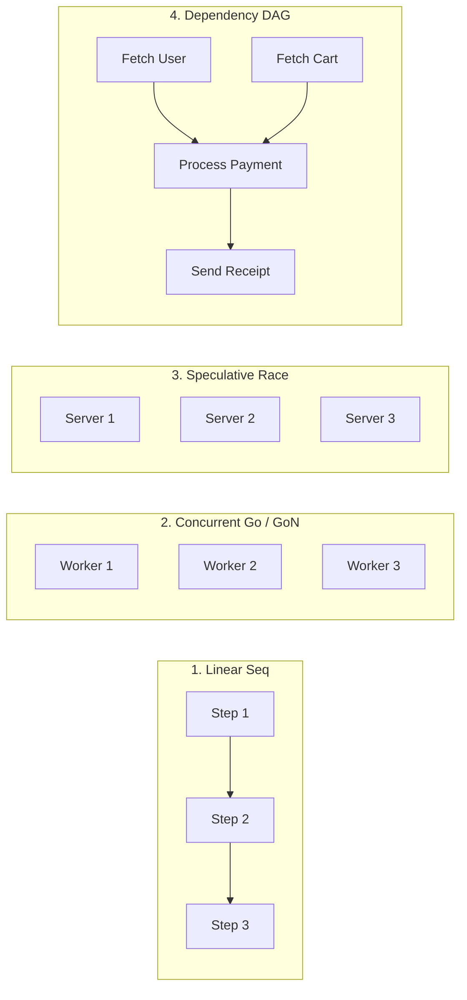
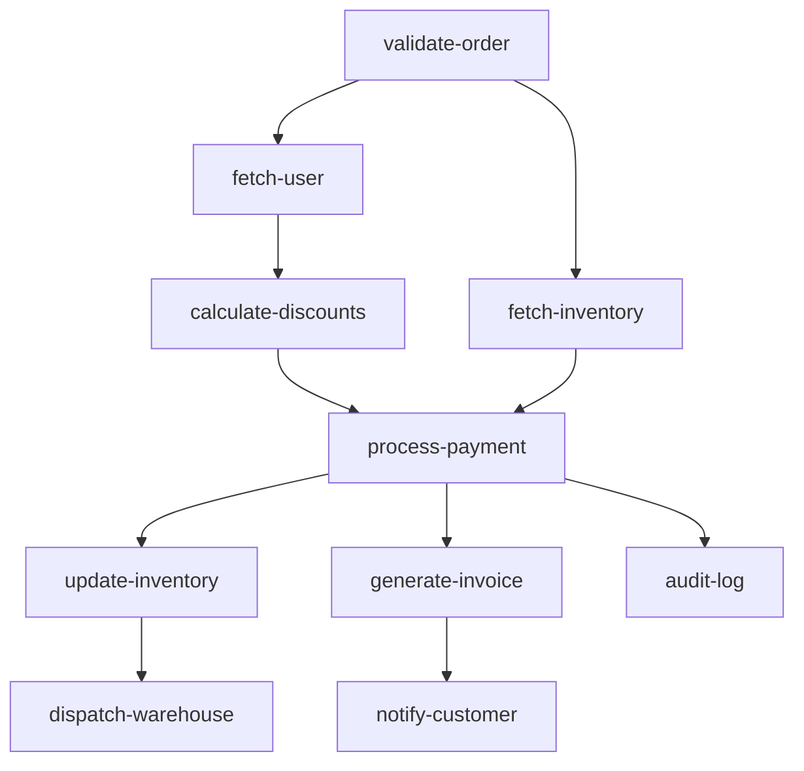

# go-flow

[](https://github.com/ntkwan/go-flow/actions/workflows/ci.yml)
[](https://pkg.go.dev/github.com/ntkwan/go-flow)
[](https://go.dev)
[](https://github.com/ntkwan/go-flow/releases)
[](https://github.com/ntkwan/go-flow/actions)
[](LICENSE)

A structured concurrency and workflow library for Go (1.24+). Built with generics, standard iterators, and zero external dependencies.

Inspired by C++26 `std::execution` ([`NVIDIA/stdexec`](https://github.com/NVIDIA/stdexec)), `go-flow` replaces manual goroutine management and channel synchronization with declarative, cancellable execution pipelines and dependency graphs.

Detailed guides and patterns are available in [GETTING_STARTED.md](GETTING_STARTED.md).

---

## Why go-flow?

Concurrent Go code often turns into boilerplate: goroutines, channels, waitgroups, select blocks, and error joins tangled with business logic.

`go-flow` lets you write workflows as explicit dependency graphs and linear pipelines:

- **Readable & Maintainable**: Business logic stays in normal Go functions. Timeouts, retries, fallbacks, and recovery are attached as step decorators.
- **Graph-Based Construction**: Declare DAG workflows with `.After("depA", "depB")`, validate cycles at startup, and export diagrams with `plan.ToMermaid()`.
- **Easy for Static Tools & AI**: Because dependencies are declared explicitly in code instead of wired through runtime channel passing, tools and AI agents can read the full execution graph directly from the AST without grepping through goroutine closures.

---

## Installation

```bash
go get github.com/ntkwan/go-flow
```

---

## Mental Model



---

## Basic Usage

### Sequential Execution (`Seq` / `.Then()`)

Runs steps in sequential order and stops on the first error encountered:

```go
pipeline := flow.Seq(
    validateInput,
    fetchUserData,
    saveRecord,
)

// Or using method chaining:
pipeline = flow.Step[context.Context](validateInput).
    Then(fetchUserData).
    Then(saveRecord)

if err := pipeline.Exec(ctx); err != nil {
    log.Println("Pipeline failed:", err)
}
```

### Concurrent Execution (`Go` / `.Go()`)

Runs steps concurrently and joins all encountered errors:

```go
fetchUserProfile := flow.Go(
    fetchAccount,
    fetchOrders,
    fetchPreferences,
)

if err := fetchUserProfile.Exec(ctx); err != nil {
    log.Println("Concurrent execution failed:", err)
}
```

### Bounded Concurrency (`GoN` / `.GoN()`)

Runs steps concurrently with a worker limit to control resource utilization:

```go
processBatch := flow.GoN(4, workerTasks...)

if err := processBatch.Exec(ctx); err != nil {
    log.Println("Batch processing failed:", err)
}
```

### Dependency Graph (`DAG`)

```go
validateNode  := flow.Node("validate-order", validateOrder)
userNode      := flow.Node("fetch-user", fetchUser).After("validate-order")
inventoryNode := flow.Node("fetch-inventory", fetchInventory).After("validate-order")
discountNode  := flow.Node("calculate-discounts", calculateDiscounts).After("fetch-user")
paymentNode   := flow.Node("process-payment", processPayment).After("calculate-discounts", "fetch-inventory")
updateInvNode := flow.Node("update-inventory", updateInventory).After("process-payment")
invoiceNode   := flow.Node("generate-invoice", generateInvoice).After("process-payment")
auditNode     := flow.Node("audit-log", auditLog).After("process-payment")
notifyNode    := flow.Node("notify-customer", notifyCustomer).After("generate-invoice")
dispatchNode  := flow.Node("dispatch-warehouse", dispatchWarehouse).After("update-inventory")

plan := flow.NewDAG(
 validateNode, userNode, inventoryNode, discountNode, paymentNode,
 updateInvNode, invoiceNode, auditNode, notifyNode, dispatchNode,
)

// Validate graph topology before execution
if err := plan.Validate(); err != nil {
 log.Fatal(err)
}

// Execute as Step[T]
workflow := plan.Step()
if err := workflow(ctx); err != nil {
 log.Println("Workflow failed:", err)
}
```

<!-- AUTO-GENERATED-DAG:START -->

<!-- AUTO-GENERATED-DAG:END -->

---

## Core Functions

| Function / Method | Description | Guide & Examples |
| :--- | :--- | :--- |
| `Seq` / `.Then()` | Runs steps in sequential order; stops on first error. | [Guide](GETTING_STARTED.md#2-sequential-execution-seq) · [Example](examples/seq/with_flow/main.go) |
| `Go` / `.Go()` | Runs steps concurrently; joins all errors. | [Guide](GETTING_STARTED.md#3-concurrent-execution-go-and-gon) · [Example](examples/go/with_flow/main.go) |
| `GoN` / `.GoN()` | Runs steps concurrently with a worker limit. | [Guide](GETTING_STARTED.md#3-concurrent-execution-go-and-gon) · [Example](examples/gon/with_flow/main.go) |
| `Race` / `.Race()` | Runs steps concurrently; returns on first success and cancels losers. | [Guide](GETTING_STARTED.md#4-speculative-racing-race) · [Example](examples/race/with_flow/main.go) |
| `DAG` / `DAGN` | Runs steps according to a directed dependency graph. | [Guide](GETTING_STARTED.md#9-dependency-graphs-dag) · [Example](examples/dag/1_named_nodes/with_flow/main.go) |
| `DAGWithReport` | Executes DAG and collects per-node latency, status, and telemetry. | [Guide](GETTING_STARTED.md#7-dag-execution-reports--observability) · [Example](examples/dag/6_conditional_and_report/main.go) |
| `Branch` / `When` | Runs steps conditionally based on runtime context. | [Guide](GETTING_STARTED.md#5-conditional-execution-branch-when-unless) · [Example](examples/branch/with_flow/main.go) |
| `Dynamic` / `.Dynamic()` | Resolves and evaluates execution steps lazily at runtime. | [Guide](GETTING_STARTED.md#5-conditional-execution-branch-when-unless-dynamic) · [Example](examples/dynamic/with_flow/main.go) |
| `Pipe` / `PipeSeq` | Transforms typed values across steps and iterators. | [Guide](GETTING_STARTED.md#6-functional-piping-pipe-pipeseq) · [Example](examples/pipe/with_flow/main.go) |
| `Each` / `Chunk` | Iterates over Go 1.23+ `iter.Seq` sequences or batches slices. | [Guide](GETTING_STARTED.md#7-iterators--batching-each-chunk) · [Example](examples/each/with_flow/main.go) |
| `Once` / `.Once()` | Ensures a step executes at most once across parallel branches. | [Guide](GETTING_STARTED.md#8-idempotent-execution-once) · [Example](examples/once/with_flow/main.go) |
| `.Retry()` | Retries a failing step up to $N$ attempts with backoff delay. | [Guide](GETTING_STARTED.md#1-method-chaining--error-handling) · [Example](examples/retry/with_flow/main.go) |
| `.Timeout()` | Applies a timeout deadline to step execution. | [Guide](GETTING_STARTED.md#1-method-chaining--error-handling) · [Example](examples/timeout/with_flow/main.go) |
| `.Fallback()` | Runs an alternate step if the primary step fails. | [Guide](GETTING_STARTED.md#1-method-chaining--error-handling) · [Example](examples/fallback/with_flow/main.go) |
| `.Catch()` | Handles or transforms step errors. | [Guide](GETTING_STARTED.md#1-method-chaining--error-handling) · [Example](examples/wrap/with_flow/main.go) |
| `.Recover()` | Catches panics and converts them into standard Go errors. | [Guide](GETTING_STARTED.md#1-method-chaining--error-handling) · [Example](examples/wrap/with_flow/main.go) |

---

## Documentation & Examples

- **[GETTING_STARTED.md](GETTING_STARTED.md)**: Full guide, step-by-step tutorials, and patterns.
- **[`examples/`](examples/)**: 15+ runnable side-by-side examples comparing standard Go with `go-flow`.

---

## License

MIT License

